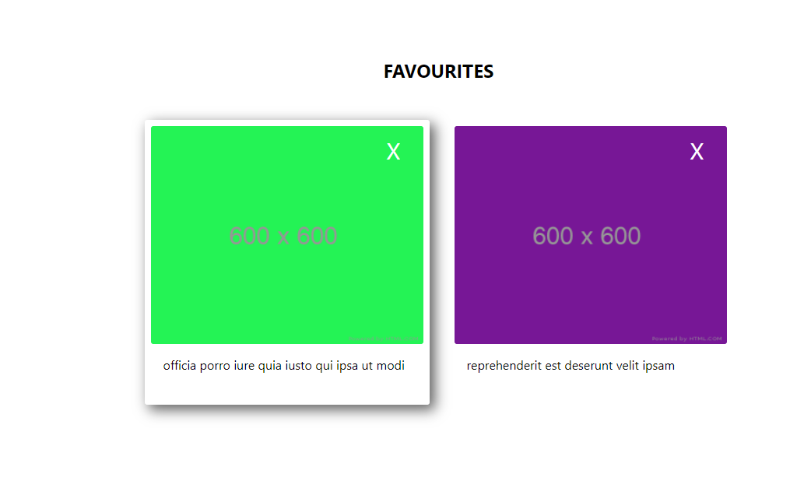

# Favourite Albums
___
 

When the application is loaded, it displays the catalog view

 
 

When the user clicks the Add button, the album is added to the favourites list

 
 

Clicking the X removes the album from the favourites list

 
 

If the page is refreshed, the favourites list is saved

 
 

## Built with:

* ReactJS
* Redux Toolkit
* Redux Persist
* HTML & CSS

 
 

## Available Scripts

In the project directory, you can run:

### `npm start`

Runs the app in the development mode.\
Open [http://localhost:3000](http://localhost:3000) to view it in your browser.
